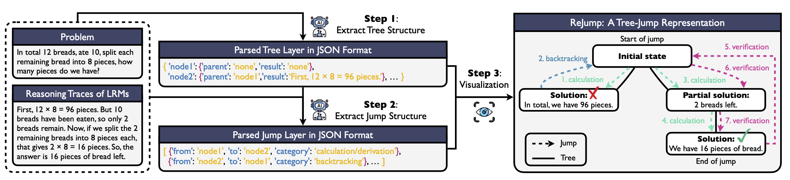

<h1 align="center"> <p>ReJump: A Tree-Jump Representation for Analyzing and Improving LLM Reasoning</p></h1>
<h4 align="center">
    <p>
      <a href="https://yzeng58.github.io/" target="_blank">Yuchen Zeng</a><sup>*1,2</sup>, 
      <a href="https://zhangshuibai.github.io/#" target="_blank">Shuibai Zhang</a><sup>*1</sup>, 
      <a href="https://wonjunn.github.io/">Wonjun Kang</a><sup>*3,4</sup>, 
      <a href="https://cychomatica.github.io/" target="_blank">Shutong Wu</a><sup>1</sup>, 
      Lynnix Zou<sup>1</sup>, 
      <a href="https://yingfan-bot.github.io/" target="_blank">Ying Fan</a><sup>1,2</sup>, 
      Heeju Kim<sup>3</sup>, 
      Ziqian Lin<sup>1</sup>, 
      <a href="https://jungtaek.github.io/" target="_blank">Jungtaek Kim</a><sup>1</sup>, 
      Hyung Il Koo<sup>3</sup>, 
      <a href="https://papail.io/" target="_blank">Dimitris Papailiopoulos</a><sup>1,2</sup>, 
      <a href="https://kangwooklee.com/aboutme/" target="_blank">Kangwook Lee</a><sup>1,5</sup>,
  </p>
  <p>
  <sup>*</sup>Equal Contribution
    <sup>1</sup>University of Wisconsin-Madison 
    <sup>2</sup>Microsoft Research
    <sup>3</sup>FuriosaAI
    <sup>4</sup>Seoul National University
    <sup>5</sup>Krafton
    
</p>
       </h4>

**Abstract**: Large Language Models (LLMs) typically reason via Chain-of-Thought (CoT) prompting or explicit training. Though many LLMs achieve similar accuracy on challenging tasks, such as math problem solving and programming, how their underlying reasoning "algorithms" compare remains poorly understood. To investigate this, we propose *ReJump*, which represents a reasoning trace as a visitation order over nodes in a tree of intermediate problem-solving steps. ReJump allows tree jumps, non-adjacent transitions between nodes that capture reasoning behaviors such as backtracking, verification, and calculation. This representation enables analyzing LLM reasoning with diverse and intuitive metrics that capture exploration, exploitation, overthinking, forgetting, and verification. We apply ReJump to analyze state-of-the-art Large Reasoning Models (LRMs), which are LLMs explicitly trained for long-form CoTs, and find that models with comparable final accuracy can nonetheless display distinct reasoning behaviors. We further compare distilled LRMs with their teachers, CoT-prompted LLMs with LRMs, and investigate how reasoning examples influence reasoning behavior. Finally, we show that ReJump can improve reasoning quality at test time through strategies such as ReJump-guided Best-of-N selection and prompt selection.




# News  🚀

- Our paper is available on [ArXiv](https://arxiv.org/abs/2512.00831)!

# Contents

- [Step 1: Set Up Environment](#step-1-set-up-environment)
- [Step 2: Collect LLM Responses on MATH500 and Game of 24](#step-2-collect-llm-responses-on-math500-and-game-of-24)
  - [MATH500](#math500)
  - [Game of 24](#game-of-24)
- [Step 3: Perform Reasoning Analysis via ReJump](#step-3-perform-reasoning-analysis-via-rejump)
  - [MATH500](#math500)
  - [Game of 24](#game-of-24)

# Step 1: Set Up Environment

To set up the environment for benchmarking LLMs on meme humor, please follow the following steps. This works for linux. 

1. Clone this repository.

   ```bash
   git clone https://github.com/UW-Madison-Lee-Lab/ReJump.git
   cd ReJump
   ```

2. Install dependencies.

   ```bash
   # create the environment that works for all experiments in our paper
   conda env create -f conda_env/liftr.yml
   conda activate liftr
   pip install -e .
   ```

3. Create `environment.py` in the `liftr` directory. Note that many variables need you to config except `root_dir` on your own

   ```python
    import os
    root_dir = os.path.dirname(os.path.abspath(__file__))
    
    OPENAI_API_KEY = '<your-openai-api-key>'
    HUGGINGFACE_API_KEY = '<your-huggingface-api-key>'
    ANTHROPIC_API_KEY = '<your-anthropic-api-key>'
    GEMINI_API_KEY = "<your-gemini-api-key>"
    DEEPSEEK_API_KEY = "<your-deepseek-api-key>"
    OPENROUTER_API_KEY = "<your-openrouter-api-key>"
    XAI_API_KEY = "<your-xai-api-key>"
    ALIBABA_API_KEY = "<your-alibaba-api-key>"
    
    HF_HOME = "<path-to-your-hf-home>"
    TRANSFORMERS_CACHE = "<path-to-your-transformers-cache>"
    TRITON_CACHE_DIR="<path-to-your-triton-cache>"
    
    WANDB_INFO = {
        'project': 'liftr',
        'entity': '<your-wandb-entity>'
    }
    
    CONDA_PATH = f"<path-to-your-conda>"
    ```
    
    **Important: Do not commit this file to version control**. This file contains sensitive API keys and should not be synced via GitHub or any other version control system to prevent security risks.

# Step 2: Collect LLM Responses on MATH500 and Game of 24

Check `constants.py` for all supported LLMs.

## MATH500
```bash
python -m run_exps.create_exps \
--dataset math500 \
--model <model_name> \
--mode reasoning \
--shot 0 \
--n_samples 500 \
--n_query 1 \
--exp_name <exp_name> \
--temperature <temperature> 

bash run_exps/auto/run_all_<exp_name>.sh
```

## Game of 24

```bash
python -m run_exps.create_exps \
--dataset game24 \
--model <model_name> \
--mode reasoning \
--shot 0 \
--n_samples 100 \
--n_query 1 \
--exp_name <exp_name> \
--temperature <temperature> 

bash run_exps/auto/run_all_<exp_name>.sh
```

## Sudoku (5*5 Latin Square)
```
python -m run_exps.create_exps \
--dataset sudoku \
--model <model_name> \
--mode reasoning \
--shot 0 \
--n_samples 100 \
--n_query 1 \
--exp_name <exp_name> \
--temperature <temperature>

bash run_exps/auto/run_all_<exp_name>.sh
```

# Step 3: Perform Reasoning Analysis via ReJump

## MATH500
```bash
python -m TTT.tree_vis_math_v3 \
--dataset math500 \
--model_name <model_name> \
--temperature <temperature> \
--num_samples 500 \
--wandb
```

## Game of 24
```bash
python -m TTT.tree_vis_game24 \
--dataset game24 \
--model_name <model_name> \
--temperature <temperature> \
--num_samples 100 \
--wandb
```

## Sudoku (5*5 Latin Square)
```bash
python -m TTT.tree_vis_game24 \
--dataset sudoku \
--model_name <model_name> \
--temperature <temperature> \
--num_samples 100 \
--wandb
```
