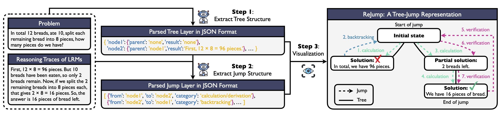

<h1 align="center"> <p>ReJump: A Tree-Jump Representation for Analyzing and Improving LLM Reasoning</p></h1>
<h4 align="center">
    <p>
      <a href="https://yzeng58.github.io/" target="_blank">Yuchen Zeng</a><sup>*1,2</sup>, 
      <a href="https://zhangshuibai.github.io/#" target="_blank">Shuibai Zhang</a><sup>*1</sup>, 
      <a href="https://wonjunn.github.io/">Wonjun Kang</a><sup>*3,4</sup>, 
      <a href="https://cychomatica.github.io/" target="_blank">Shutong Wu</a><sup>1</sup>, 
      Lynnix Zou<sup>1</sup>, 
      <a href="https://yingfan-bot.github.io/" target="_blank">Ying Fan</a><sup>1,2</sup>, 
      Heeju Kim<sup>3</sup>, 
      Ziqian Lin<sup>1</sup>, 
      <a href="https://jungtaek.github.io/" target="_blank">Jungtaek Kim</a><sup>1</sup>, 
      Hyung Il Koo<sup>3</sup>, 
      <a href="https://papail.io/" target="_blank">Dimitris Papailiopoulos</a><sup>1,2</sup>, 
      <a href="https://kangwooklee.com/aboutme/" target="_blank">Kangwook Lee</a><sup>1,5</sup>,
  </p>
  <p>
  <sup>*</sup>Equal Contribution
    <sup>1</sup>University of Wisconsin-Madison 
    <sup>2</sup>Microsoft Research
    <sup>3</sup>FuriosaAI
    <sup>4</sup>Seoul National University
    <sup>5</sup>Krafton
    
</p>
       </h4>

**Abstract**: Large Reasoning Models (LRMs) are Large Language Models (LLMs) explicitly trained to generate long-form Chain-of-Thoughts (CoTs), achieving impressive success on challenging tasks like math and programming. However, their underlying reasoning "algorithms" remain poorly understood. To investigate this, we propose *ReJump*, which represents a reasoning trace as a visitation order over nodes in a tree of intermediate problem-solving steps. Transitions between nodes, which we term *jumps*, include adjacent moves that capture behaviors such as calculation, and non-adjacent moves that capture behaviors such as backtracking and verification. ReJump enables analyzing LLM reasoning with diverse metrics that quantify exploration, exploitation, overthinking, forgetting, and verification. Using our proposed LLM agent to extract reasoning traces into ReJump format, we evaluate state-of-the-art LRMs on two tasks and find that models with similar accuracy can exhibit distinct reasoning behaviors, while different tasks favor different reasoning styles (e.g., varying balance between exploration and exploitation). To further understand how learning strategies shape reasoning, we use ReJump to compare distilled LRMs with their teachers, compare CoT-prompted LLMs with LRMs, and examine how reinforcement learning affects reasoning behavior. Finally, we show that ReJump can improve reasoning quality at test time through strategies such as ReJump-guided Best-of-N selection and prompt selection.

**Links**: [Paper (arXiv)](https://arxiv.org/abs/2512.00831) | [OpenReview](https://openreview.net/forum?id=hlUgEwl3Du)




# News  🚀

- [May 2026] Our paper is accepted to ICML 2026!
- [Dec 2025] Our paper is available on [arXiv](https://arxiv.org/abs/2512.00831).

# Contents

- [Step 1: Set Up Environment](#step-1-set-up-environment)
- [Step 2: Collect LLM Responses on MATH-500, Game of 24, and Sudoku](#step-2-collect-llm-responses-on-math-500-game-of-24-and-sudoku)
  - [MATH-500](#math-500)
  - [Game of 24](#game-of-24)
  - [Sudoku (5x5 Latin Square)](#sudoku-5x5-latin-square)
- [Step 3: Perform Reasoning Analysis via ReJump](#step-3-perform-reasoning-analysis-via-rejump)
  - [MATH-500](#math-500-1)
  - [Game of 24](#game-of-24)
  - [Sudoku (5x5 Latin Square)](#sudoku-5x5-latin-square-1)

# Step 1: Set Up Environment

To set up the environment for ReJump extraction, analysis, and experiment scripts, follow these steps on Linux.

1. Clone this repository.

   ```bash
   git clone https://github.com/UW-Madison-Lee-Lab/ReJump.git
   cd ReJump
   ```

2. Install dependencies.

   ```bash
   # create the environment that works for all experiments in our paper
   conda env create -f conda_env/rejump.yml
   conda activate rejump
   pip install -e .
   ```

3. Create a local `environment.py` at the repository root. This file is ignored by git and must never be committed.

   ```bash
   cp environment.example.py environment.py
   # Fill in only the keys/paths needed for the scripts you plan to run.
   ```
     
   **Important: do not commit `environment.py`.** It contains local API keys and machine-specific paths. The checked-in `environment.example.py` contains placeholders only.

# Step 2: Collect LLM Responses on MATH-500, Game of 24, and Sudoku

Check `constants.py` for all supported LLMs.

## MATH-500
```bash
python -m run_exps.create_exps \
--dataset math500 \
--model <model_name> \
--mode reasoning \
--shot 0 \
--n_samples 500 \
--n_query 1 \
--exp_name <exp_name> \
--temperature <temperature> 

bash run_exps/auto/run_all_<exp_name>.sh
```

## Game of 24

```bash
python -m run_exps.create_exps \
--dataset game24 \
--model <model_name> \
--mode reasoning \
--shot 0 \
--n_samples 100 \
--n_query 1 \
--exp_name <exp_name> \
--temperature <temperature> 

bash run_exps/auto/run_all_<exp_name>.sh
```

## Sudoku (5x5 Latin Square)
```
python -m run_exps.create_exps \
--dataset sudoku \
--model <model_name> \
--mode reasoning \
--shot 0 \
--n_samples 100 \
--n_query 1 \
--exp_name <exp_name> \
--temperature <temperature>

bash run_exps/auto/run_all_<exp_name>.sh
```

# Step 3: Perform Reasoning Analysis via ReJump

## MATH-500
```bash
python -m rejump_extractor.tree_vis_math_v3 \
--dataset_name math500 \
--model_name <model_name> \
--temperature <temperature> \
--num_samples 500 \
--wandb
```

## Game of 24
```bash
python -m rejump_extractor.tree_vis_game24 \
--dataset_name game24 \
--model_name <model_name> \
--temperature <temperature> \
--num_samples 100 \
--wandb
```

## Sudoku (5x5 Latin Square)
```bash
python -m rejump_extractor.tree_vis_sudoku \
--dataset_name sudoku \
--model_name <model_name> \
--temperature <temperature> \
--num_samples 100 \
--wandb
```
